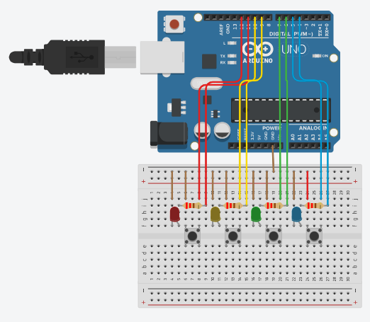

# Button Colour Selector

in this code the user would press the button to turn on the light and then press it again to turn off the light. Each colour has its own light so the user can pick which light would be on and which lights would be off.

