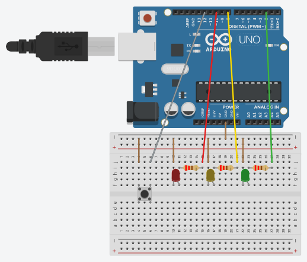

# Traffic Light

in this code the user would press the button which would then turn on the next light in the secquence and turn off the previous light. The order is how traffic lights work hints the name.

