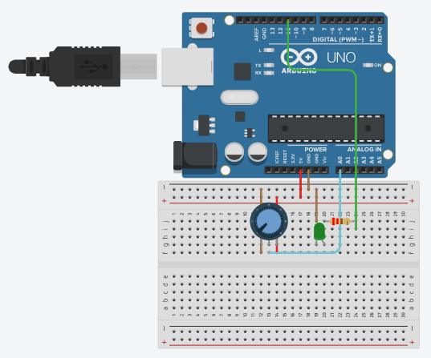

# Potentiometer

In this code there is a potentiometer where the user can rotate it to the right to increase the brightness of the LED and rotate it to the left to decrease the brightness of the LED

