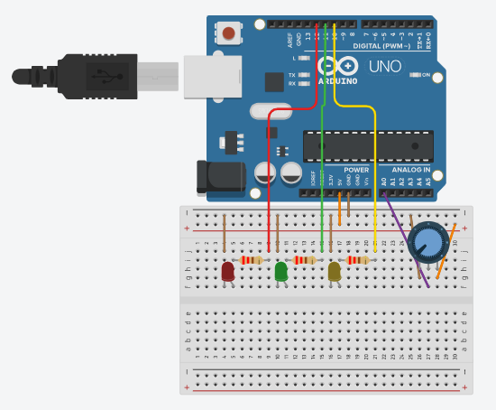

# Warning Light

in this code the user can use the potentiometer and if value is between 0-500 the light should be green. if the potentiometer value is between 501-800 the light should be yellow. if the potentiometer value is between 801-1023 the light should be red

